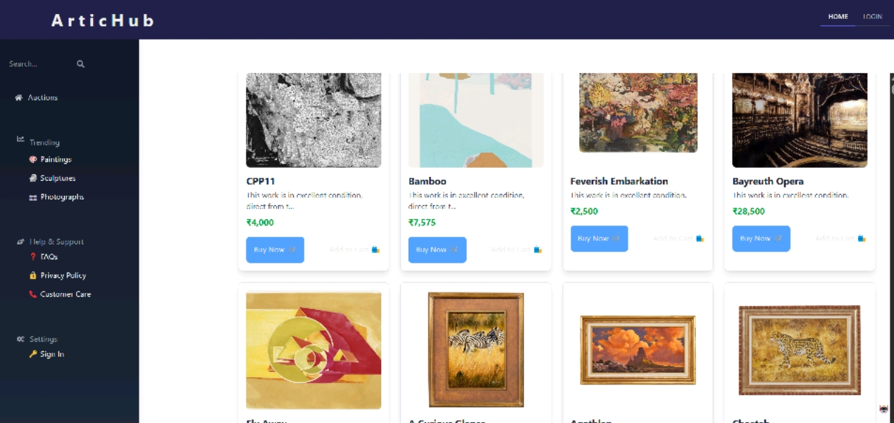

# ⚡️ ArticHub: The Future of  Art Commerce 🖼️✨

Welcome to **ArticHub**, a cutting-edge platform where **creativity meets code**, and **art meets AI**. Empowering artists to **sell or auction their masterpieces**, and helping buyers to **discover & bid on unique art** — all in a smooth, intelligent ecosystem.

<br/>

 <!-- You can design a banner with neon glitch vibes on Canva or Figma and link it here -->

---

## 🚀 Features

> ArticHub isn’t just a platform. It’s a **movement** for creators.

- 🎨 **Multi-Vendor Art Store**  
  Artists can register, list their artwork, and manage their digital gallery.

- ⌛ **Auction System**  
  Run timed auctions where buyers place live bids on unique artworks.

- 🧠 **AI-Powered Price Prediction**  
  Smart pricing suggestions for sellers using historical and visual data.

- 🖖 **Smart Recommendations**  
  Personalized art suggestions for buyers based on preference and browsing history.

- 🔐 **Secure Auth (DRF)**  
  Fully secured API-based authentication for both buyers and sellers.

- 📈 **Sales Analytics Dashboard (Coming Soon)**  
  Sellers can visualize their performance, bidding activity, and top-selling categories.

---

## ⚙️ Tech Stack

| Frontend | Backend | AI/ML | Database | Other |
|---------|---------|--------|----------|-------|
| React.js ⚛️ | Django + DRF 🐍 | Scikit-Learn 🧠 | MySQL 🐘 | JWT Auth 🔐 |
| TailwindCSS 🎨 | Django ORM 🧩 | Custom Recommender System 🎯 | | REST APIs 🚀 |

---

## 🧠 AI Modules Breakdown

- **🎯 Recommender System**  
  > Content-based filtering using style, color palette, and price range to suggest artwork.

- **💸 Price Prediction**  
  > Trained regression model that predicts optimal listing price based on input art characteristics.

- **📊 Future Add-On: Style Classifier**  
  > Using CNN to classify art style and recommend tags & pricing insights (WIP 🚧).

---

## 📸 Screenshots

<!-- Insert futuristic UI screenshots here -->
| Home Page | Auctions | Seller Dashboard |
|----------|----------|------------------|
|  |  |  |

---

## 🔧 Setup Instructions

> Clone it. Run it. Rule the art world.

```bash
# 1. Clone the repo
git clone https://github.com/HiteshXG/Artichub.git
cd Artichub1

# 2. Backend Setup
cd server
python3 -m venv venv
source venv/bin/activate
pip install -r requirements.txt
python manage.py migrate
python manage.py runserver

# 3. Frontend Setup
cd ../frontend
npm install
npm start
