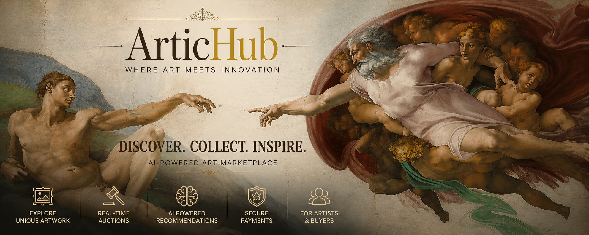
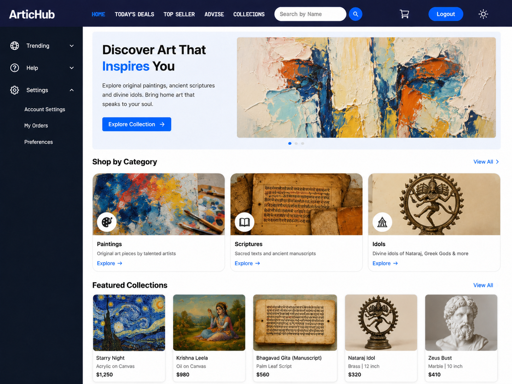
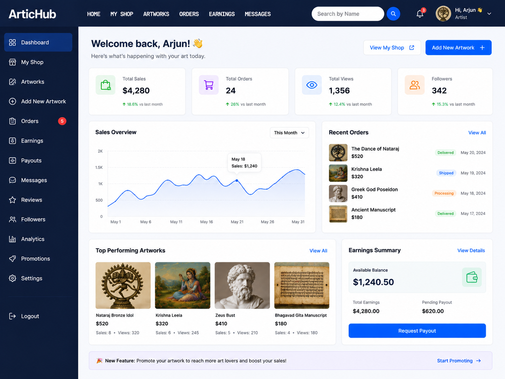
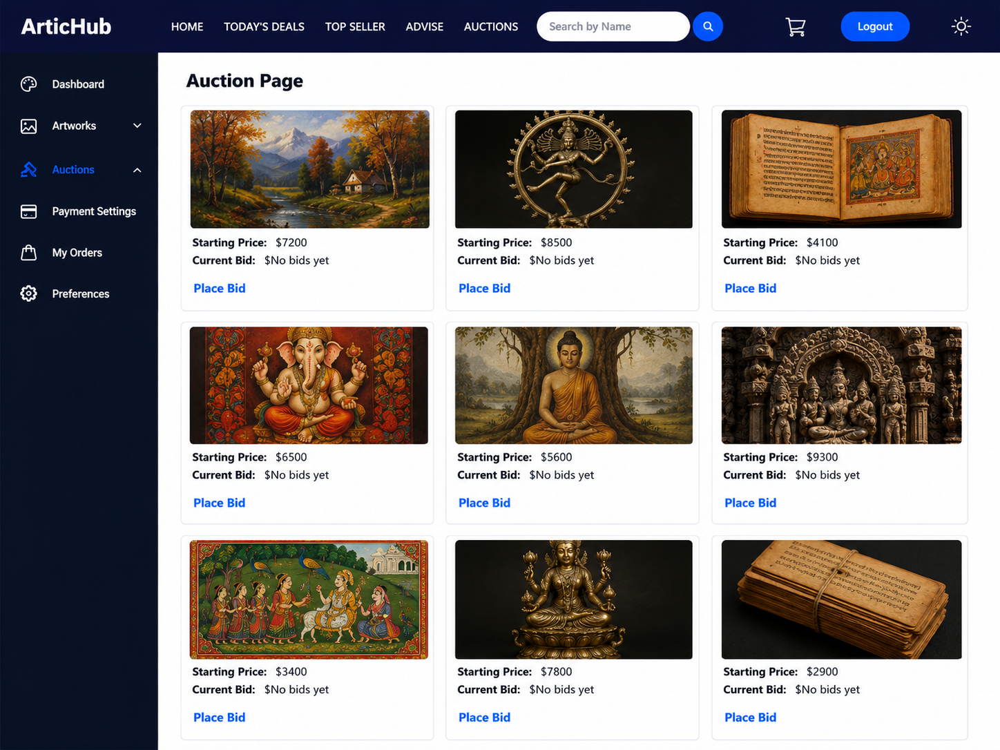
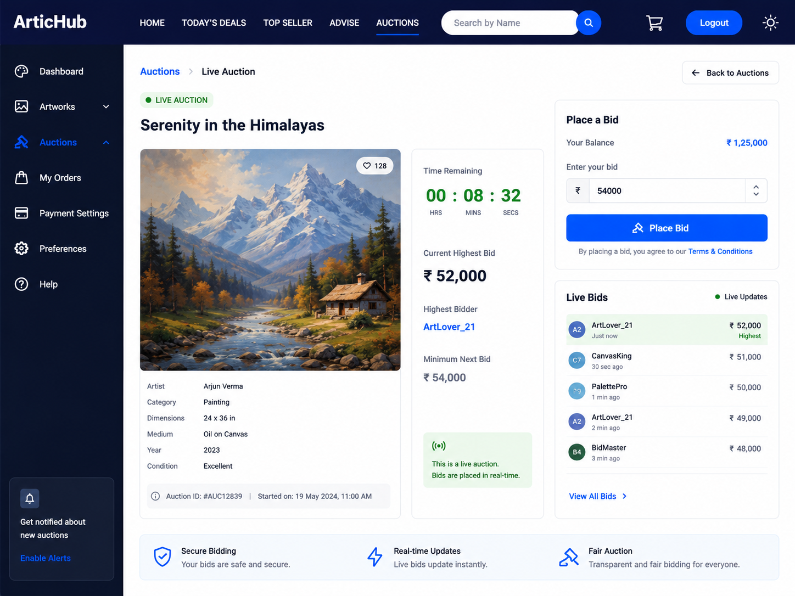
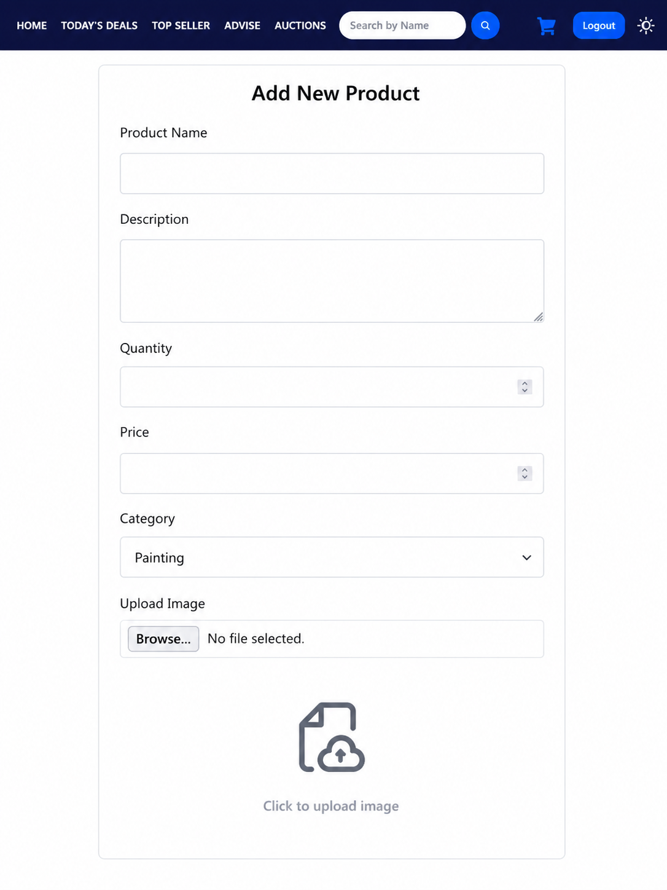
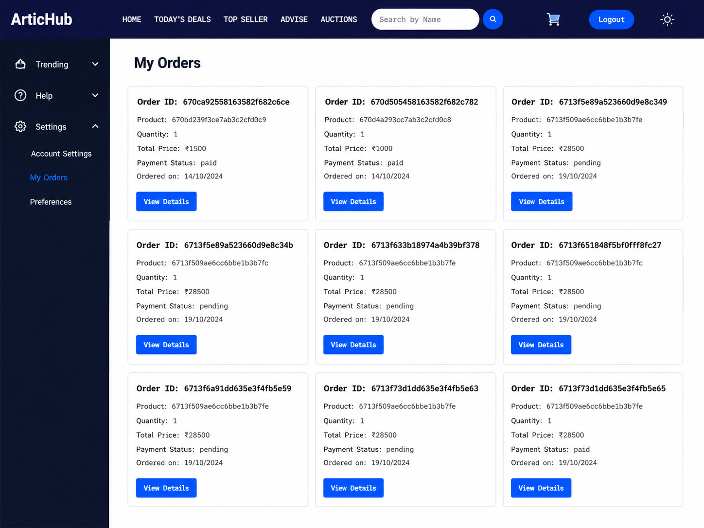
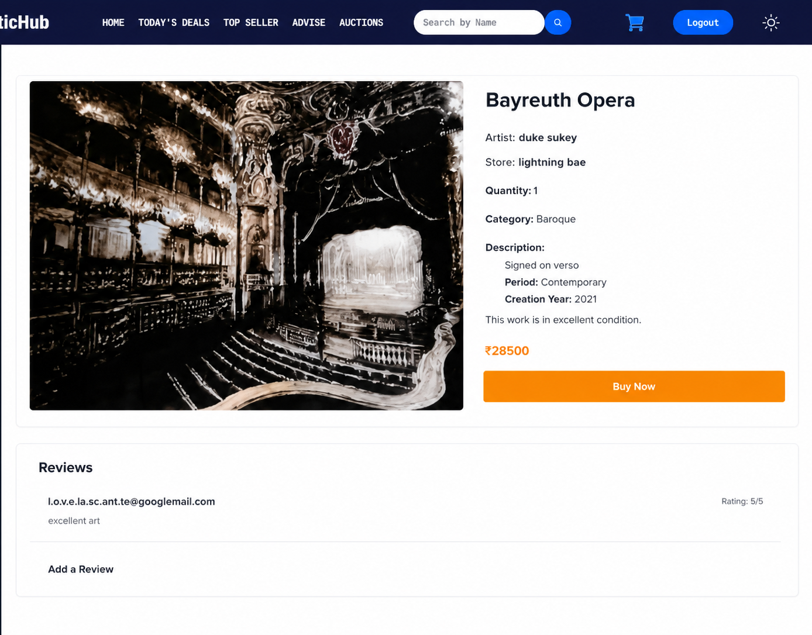
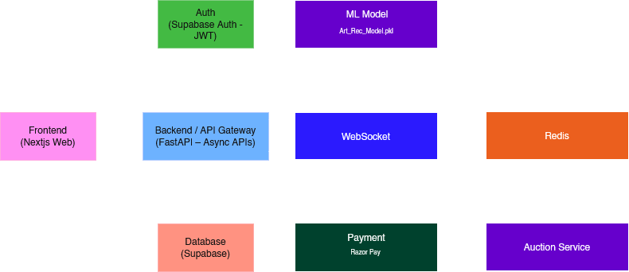

<div align="center">

# ArticHub

### AI-Powered Digital Art Marketplace

A full-stack marketplace where artists can showcase and sell artwork while buyers discover, purchase, receive AI-powered recommendations, and participate in real-time auctions.

<p align="center">
  
</p>


<br><br>https://github.com/HiteshXG/Artichub/

[](https://skill-link-brown.vercel.app/)
[](#license)
[]()
[]()
[]()
[]()
[]()

</div>

---

# Table of Contents

<details>
<summary>Click to Expand</summary>

- [Live Demo](#live-demo)
- [Features](#features)
- [Screenshots](#screenshots)
- [Tech Stack](#tech-stack)
- [System Architecture](#system-architecture)
- [Folder Structure](#folder-structure)
- [Installation](#installation)
- [Environment Variables](#environment-variables)
- [Running the Project](#running-the-project)
- [API Endpoints](#api-endpoints)
- [Future Improvements](#future-improvements)
- [Author](#author)
- [License](#license)

</details>

---

# Live Demo

🔗 https://artichub-theta.vercel.app/

---

# Features

| Feature | Description |
|----------|-------------|
| JWT Authentication | Secure user authentication and authorization |
| Artist Dashboard | Manage artworks, auctions, and profile |
| Artwork Marketplace | Browse and purchase artwork |
| AI Recommendations | Personalized artwork recommendations using Machine Learning |
| Live Auctions | Real-time bidding using WebSockets |
| Shopping Cart | Add, remove, and purchase artwork |
| Secure Payments | Razorpay payment integration |
| User Roles | Artist, Customer, and Admin support |
| Search & Filter | Easily discover artwork |
| Responsive Design | Optimized for desktop and mobile |


<p align="right">(<a href="#readme-top">⬆ Back to Top</a>)</p>

---

# Screenshots

### Home

<div align="center">

### Buyer



<br><br>

### Seller

   

   </div>

---

### Auction

<div align="center">

### Auction Page



<br><br>

### Live Auction Page

   

   </div>

---

### Orders and Items

<div align="center">

### New Product Page



<br><br>

### Orders

   

   </div>

---

### Cart


<div align="center">

### Cart




<p align="right">(<a href="#readme-top">⬆ Back to Top</a>)</p>

---
# Tech Stack

### Frontend


### Backend


<p align="right">(<a href="#readme-top">⬆ Back to Top</a>)</p>

---

# System Architecture

<div align="center">

</div>

<br></br>

### Workflow

1. Users register or log in using JWT authentication.
2. Artists upload and manage artwork listings.
3. Buyers browse artworks and receive AI-powered recommendations.
4. Artwork details are fetched from PostgreSQL through Django REST APIs.
5. Users participate in live auctions using Django Channels, Redis, and WebSockets.
6. Buyers add artwork to their shopping cart and proceed to checkout.
7. Razorpay securely processes payments and verifies transactions.
8. Orders are stored in PostgreSQL.
9. Users can view order history, auction history, and recommended artwork.


<p align="right">(<a href="#readme-top">⬆ Back to Top</a>)</p>

---

# Folder Structure

<details>

<summary>Click to Expand</summary>

```text
Artichub/
├── client/
│   ├── package.json
│   ├── src/
│   │   ├── App.jsx
│   │   ├── components/
│   │   │   ├── Auction/
│   │   │   ├── AuthContext.jsx
│   │   │   ├── ml/
│   │   │   └── pages/
│   │   └── main.jsx
│   └── vite.config.js
├── requirements.txt
└── server/
    ├── Account/
    ├── ArticHub/
    │   ├── settings.py
    │   └── urls.py
    ├── Arts/
    │   ├── models.py
    │   └── views.py
    ├── auction/
    │   ├── consumers.py
    │   └── routing.py
    ├── manage.py
    ├── payments/
    │   └── views.py
    └── recommendation/
        ├── art_recommendation_model.pkl
        └── views.py
```

</details>


<p align="right">(<a href="#readme-top">⬆ Back to Top</a>)</p>

---

# Installation

## Clone Repository

```bash
git clone https://github.com/HiteshXG/Artichub.git
```

---

## Backend

```bash
cd server

python -m venv venv

# Windows
venv\Scripts\activate

# Linux/macOS
source venv/bin/activate

pip install -r requirements.txt

python manage.py migrate

python manage.py runserver
```

---

## Frontend

```bash
cd client

npm install

npm run dev
```


<p align="right">(<a href="#readme-top">⬆ Back to Top</a>)</p>

---

# Environment Variables

## Backend

Create a `.env` file inside the Backend directory.

```env
SECRET_KEY=

DEBUG=True

DATABASE_URL=

JWT_SECRET=

REDIS_URL=

RAZORPAY_KEY_ID=

RAZORPAY_KEY_SECRET=
```

---

## Frontend

Create a `.env` file inside the Frontend directory.

```env
VITE_API_BASE_URL=
```


<p align="right">(<a href="#readme-top">⬆ Back to Top</a>)</p>

---

# Running the Project

## Backend

```bash
cd server

python manage.py runserver
```

Backend runs on

```
http://localhost:8000
```

---

## Frontend

```bash
cd client

npm run dev
```

Frontend runs on

```
http://localhost:5173
```


<p align="right">(<a href="#readme-top">⬆ Back to Top</a>)</p>

---

# API Endpoints

## Authentication

```http
POST /api/register
```

Create a new account.

---

```http
POST /api/login
```

Authenticate a user.

---

```http
GET /api/refresh
```
Refresh JWT token.

---

```http
GET /api/logout
```

Logout the current user.

---

```http
GET /api/get-me
```

Fetch logged-in user's profile.

---

## Artwork

```http
GET /api/arts/
```

Fetch all artwork.

---

```http
POST /api/arts/
```

Update artwork.

---

```http
GET /api/arts/:id
```

Fetch Artwork details.

---

## Recommendation

```http
GET /api/recommend/:id
```

Get similar artwork recommendations.

---

## Auction

```http
WS /ws/auction/:id/
```

Real-time bidding.

---

## Payments

```http
WS /ws/auction/:id/
```

Real-time bidding.

---

```http
POST /api/payment/verify
```

Verify payment signature.

---


<p align="right">(<a href="#readme-top">⬆ Back to Top</a>)</p>

---

# Future Improvements

- AI Image Search
- NFT Marketplace Integration
- Wishlist
- Artist Analytics Dashboard
- Multi-language Support
- Email Notifications
- Artwork Reviews & Ratings
- Live Chat Between Buyers & Artists
- Advanced Search Filters
- Mobile Application


<p align="right">(<a href="#readme-top">⬆ Back to Top</a>)</p>

---

# Author

## Prashik Jadhav

[](https://github.com/codedloki/)

[](https://www.linkedin.com/in/prashikjadhav/)

---

## Hitesh Gavand

[](https://github.com/HiteshXG)

[](https://linkedin.com/in/hitesh-gavand)

[](https://x.com/hnxvrtxx)

---

## Aniket Golhait

[](https://github.com/aniketluc/)

[](https://www.linkedin.com/in/aniketgolhait1204/)


<p align="right">(<a href="#readme-top">⬆ Back to Top</a>)</p>

---

# License

This project is intended for **educational and portfolio purposes**.

If you found this project helpful, consider giving it a ⭐ on GitHub!


<p align="right">(<a href="#readme-top">⬆ Back to Top</a>)</p>

---
